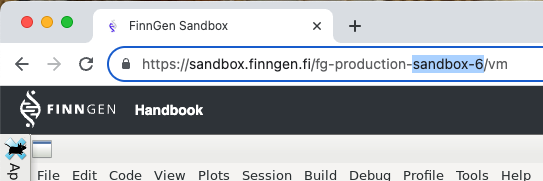

# Tutorial connection to FinnGen BQ tables

``` r
library(FinnGenUtilsR)
library(dplyr)
#> 
#> Attaching package: 'dplyr'
#> The following objects are masked from 'package:stats':
#> 
#>     filter, lag
#> The following objects are masked from 'package:base':
#> 
#>     intersect, setdiff, setequal, union
```

## Getting Started

The
[`get_fg_bq_tables()`](https://finngen.github.io/FinnGenUtilsR/reference/get_fg_bq_tables.md)
function creates a connection to FinnGen BigQuery tables and provides
easy access to all available tables.

The minimum required argument is the `environment` which specifies where
you running your queries. Typically, the environment is sandbox-XX,
where XX is the number of the sandbox you are using. You can find the
number of your sandbox in the URL when you are logged in to the FinnGen
Data Access Portal.



Moreover, for internal use it is possible to specify ‘build’ or
‘preview’ as environment.

### Create Connection to BigQuery Tables

``` r
fgbq <- get_fg_bq_tables(
  environment = "sandbox-XX"
)
#> Connecting to BigQuery...
#> Using data freeze: dev
#> Finding latest table versions...
#>   - birth_mother: sandbox_tools_dev.birth_mother_dev_dev
#>   - code_prevalence_stratified: sandbox_tools_dev.code_prevalence_stratified_dev_dev
#>   - covariates: sandbox_tools_dev.covariates_dev_dev
#>   - drug_events: sandbox_tools_dev.drug_events_dev_dev
#>   - endpoint_cohorts: sandbox_tools_dev.endpoint_cohorts_dev_dev
#>   - fg_codes_info: medical_codes.fg_codes_info_dev
#>   - finngen_vnrs: medical_codes.finngen_vnr_dev
#>   - hla_imputed: sandbox_tools_dev.hla_imputed_dev_dev
#>   - kanta: sandbox_tools_dev.kanta_dev_dev
#>   - kidney: sandbox_tools_dev.kidney_dev_dev
#>   - minimum_extended: sandbox_tools_dev.minimum_extended_dev_dev
#>   - plasma_samples: sandbox_tools_dev.plasma_samples_dev_dev
#>   - service_sector_detailed_longitudinal: sandbox_tools_dev.finngen_dev_service_sector_detailed_longitudinal
#>   - spirometry: sandbox_tools_dev.spirometry_dev_dev
#>   - vaccination: sandbox_tools_dev.vaccination_dev_dev
#>   - vision: sandbox_tools_dev.vision_dev_dev
#>   - cdm_concept: finngen_omop_dev_dev.concept
#> Creating table connections (this may take a moment)...
#> Successfully connected to all 17 tables in 7.91 seconds
```

By default
[`get_fg_bq_tables()`](https://finngen.github.io/FinnGenUtilsR/reference/get_fg_bq_tables.md)
will find the latest available data freeze and table versions but you
can specify a specific version if needed.

``` r
fgbq <- get_fg_bq_tables(
  environment = "sandbox-XX",
  dataFreeze = "r13"
)
```

### View Connection Information

The `bq_tables` object displays all relevant connection information when
printed:

``` r
fgbq
#> FinnGen BigQuery Tables Handler
#> ================================
#> 
#> Environment:      build 
#> Data Freeze:      dev 
#> Project:          atlas-development-270609 
#> Billing Project:  atlas-development-270609 
#> 
#> Available Tables:
#> -----------------
#>   [v] birth_mother                      atlas-development-270609.sandbox_tools_dev.birth_mother_dev
#>   [v] code_prevalence_stratified        atlas-development-270609.sandbox_tools_dev.code_prevalence_stratified_dev
#>   [v] covariates                        atlas-development-270609.sandbox_tools_dev.covariates_dev
#>   [v] drug_events                       atlas-development-270609.sandbox_tools_dev.drug_events_dev
#>   [v] endpoint_cohorts                  atlas-development-270609.sandbox_tools_dev.endpoint_cohorts_dev
#>   [v] fg_codes_info                     atlas-development-270609.medical_codes_dev.fg_codes_info_dev
#>   [v] finngen_vnrs                      atlas-development-270609.medical_codes_dev.finngen_vnr_dev
#>   [v] hla_imputed                       atlas-development-270609.sandbox_tools_dev.hla_imputed_dev
#>   [v] kanta                             atlas-development-270609.sandbox_tools_dev.kanta_dev
#>   [v] kidney                            atlas-development-270609.sandbox_tools_dev.kidney_dev
#>   [v] minimum_extended                  atlas-development-270609.sandbox_tools_dev.minimum_extended_dev
#>   [v] plasma_samples                    atlas-development-270609.sandbox_tools_dev.plasma_samples_dev
#>   [v] service_sector_detailed_longitudinal atlas-development-270609.sandbox_tools_dev.finngen_dev_service_sector_detailed_longitudinal
#>   [v] spirometry                        atlas-development-270609.sandbox_tools_dev.spirometry_dev
#>   [v] vaccination                       atlas-development-270609.sandbox_tools_dev.vaccination_dev
#>   [v] vision                            atlas-development-270609.sandbox_tools_dev.vision_dev
#>   [v] cdm_concept                       atlas-development-270609.finngen_omop_dev.concept
```

This shows: - Environment (e.g., build, sandbox, preview) - Data Freeze
version (e.g., dev, r13_v3) - Project ID - Billing Project ID - All
available tables with their full paths in case you want to run raw SQL
queries

## Using BigQuery Tables

The `bq_tables` object provides access to all tables through the `tbl`
field. These tables can be used as if they were tibbles thanks to
[dbplyr](https://dbplyr.tidyverse.org/).

### Available Tables

You can view all available table names:

``` r
names(fgbq$tbl)
#>  [1] "birth_mother"                        
#>  [2] "code_prevalence_stratified"          
#>  [3] "covariates"                          
#>  [4] "drug_events"                         
#>  [5] "endpoint_cohorts"                    
#>  [6] "fg_codes_info"                       
#>  [7] "finngen_vnrs"                        
#>  [8] "hla_imputed"                         
#>  [9] "kanta"                               
#> [10] "kidney"                              
#> [11] "minimum_extended"                    
#> [12] "plasma_samples"                      
#> [13] "service_sector_detailed_longitudinal"
#> [14] "spirometry"                          
#> [15] "vaccination"                         
#> [16] "vision"                              
#> [17] "cdm_concept"
```

### Accessing Tables

Access individual tables using the `$tbl` field:

``` r
fgbq$tbl$service_sector_detailed_longitudinal |> head()
#> # Source:   SQL [?? x 16]
#> # Database: BigQueryConnection
#>   FINNGENID  SOURCE EVENT_AGE APPROX_EVENT_DAY CODE1   CODE2 CODE3  CODE4 CODE5
#>   <chr>      <chr>      <dbl> <date>           <chr>   <chr> <chr>  <chr> <chr>
#> 1 FG00000001 PURCH       41.9 2018-04-30       C10AA05 NA    119478 1     NA   
#> 2 FG00000001 PURCH       42.1 2018-07-01       R03BA07 NA    007549 1     NA   
#> 3 FG00000001 PURCH       42.2 2018-08-15       D06BX01 NA    007623 1     NA   
#> 4 FG00000001 PURCH       42.6 2018-12-16       R01AD08 NA    018285 1     NA   
#> 5 FG00000001 PURCH       41.9 2018-04-14       A06AC01 NA    063219 1     NA   
#> 6 FG00000001 PURCH       41.8 2018-03-07       C10AA02 NA    014253 1     NA   
#> # ℹ 7 more variables: CODE6 <chr>, CODE7 <chr>, CODE8 <chr>, CODE9 <chr>,
#> #   ICDVER <chr>, CATEGORY <chr>, INDEX <chr>
```

(same table in html format for exploration)

You can treat these tables as if they were regular tibbles. For example,
to filter for events with code “D45” in the OUTPAT source:

``` r
# Get events with code "J45" in OUTPAT
fgbq$tbl$service_sector_detailed_longitudinal |> 
  filter(CODE1 == "J45" & SOURCE == "OUTPAT") |> 
  glimpse()
#> Rows: ??
#> Columns: 16
#> Database: BigQueryConnection
#> $ FINNGENID        <chr> "FG00001468", "FG00001845", "FG00001981", "FG00001993…
#> $ SOURCE           <chr> "OUTPAT", "OUTPAT", "OUTPAT", "OUTPAT", "OUTPAT", "OU…
#> $ EVENT_AGE        <dbl> 23.655, 29.656, 57.717, 21.760, 68.846, 71.852, 14.09…
#> $ APPROX_EVENT_DAY <date> 2018-08-26, 2016-07-12, 2021-01-11, 2019-12-25, 2005…
#> $ CODE1            <chr> "J45", "J45", "J45", "J45", "J45", "J45", "J45", "J45…
#> $ CODE2            <chr> NA, NA, "J45", NA, NA, NA, NA, NA, NA, NA, NA, NA, NA…
#> $ CODE3            <chr> NA, NA, NA, NA, NA, NA, NA, NA, NA, NA, NA, NA, NA, N…
#> $ CODE4            <chr> NA, NA, NA, NA, NA, NA, NA, NA, NA, NA, NA, NA, NA, N…
#> $ CODE5            <chr> "93", "92", NA, NA, "91", "2", "92", NA, NA, NA, NA, …
#> $ CODE6            <chr> "65", "10E", "70", "96", "20", "55", "30", "15Y", "10…
#> $ CODE7            <chr> NA, NA, NA, NA, NA, NA, NA, NA, NA, NA, NA, NA, NA, N…
#> $ CODE8            <chr> "R52", NA, "R52", "R10", NA, NA, NA, "R10", "R10", "R…
#> $ CODE9            <chr> "E", NA, "E", "E", NA, NA, NA, "6", "E", "E", "E", NA…
#> $ ICDVER           <chr> "10", "10", "10", "10", "10", "10", "10", "10", "10",…
#> $ CATEGORY         <chr> "2", "1", "1", "2", "1", "1", "1", "1", "1", "2", "3"…
#> $ INDEX            <chr> "682342", "828784", "970654", "972744", "1257416", "1…
```

Or other tidyverse functions like
[`stringr::str_detect()`](https://stringr.tidyverse.org/reference/str_detect.html)

``` r
# This will error
fgbq$tbl$service_sector_detailed_longitudinal |> 
  filter(stringr::str_detect(CODE1, "^J45")) |> 
  count(CODE1) |> 
  head() |> 
  glimpse()
#> Rows: ??
#> Columns: 2
#> Database: BigQueryConnection
#> $ CODE1 <chr> "J450", "J459", "J451", "J45", "J458"
#> $ n     <int64> 88559, 183889, 58219, 100414, 13542
```

### Joining Tables

You can join multiple tables together. For example, to get smoking
status for asthma patients:

``` r
fgbq$tbl$service_sector_detailed_longitudinal |> 
  filter(stringr::str_detect(CODE1, "^J45")) |> 
  distinct(FINNGENID) |> 
  left_join(
    fgbq$tbl$minimum_extended, 
    by = "FINNGENID"
  ) |> 
  count(SMOKE2, SMOKE3, sort = TRUE) |> 
  head()|> 
  glimpse()
#> Rows: ??
#> Columns: 3
#> Database: BigQueryConnection
#> Ordered by: desc(n)
#> $ SMOKE2 <chr> "no", NA, "no", NA, "no", "yes"
#> $ SMOKE3 <chr> NA, NA, "never", "never", "current", NA
#> $ n      <int64> 43697, 35806, 32092, 26376, 16633, 15056
```

### Collect results into R

Once you have reduce the size of the total data you can download it into
memory using
[`collect()`](https://dplyr.tidyverse.org/reference/compute.html). For
example:

``` r
fgbq$tbl$service_sector_detailed_longitudinal |> 
  filter(stringr::str_detect(CODE1, "^J45")) |> 
  filter(EVENT_AGE > 50) |> 
  head() |>
  collect() |> 
  glimpse()
#> Rows: 6
#> Columns: 16
#> $ FINNGENID        <chr> "FG00322782", "FG00322785", "FG00322789", "FG00322789…
#> $ SOURCE           <chr> "PRIM_OUT", "PRIM_OUT", "PRIM_OUT", "PRIM_OUT", "PRIM…
#> $ EVENT_AGE        <dbl> 64.956, 84.706, 57.582, 61.407, 59.639, 61.703
#> $ APPROX_EVENT_DAY <date> 2016-08-04, 2017-10-12, 2013-02-06, 2016-12-04, 2023-…
#> $ CODE1            <chr> "J45", "J459", "J45", "J459", "J45", "J459"
#> $ CODE2            <chr> NA, NA, NA, NA, NA, NA
#> $ CODE3            <chr> NA, NA, NA, NA, NA, NA
#> $ CODE4            <chr> NA, NA, NA, NA, NA, NA
#> $ CODE5            <chr> "R10", "R90", "R10", "R20", "R52", "R20"
#> $ CODE6            <chr> "T60", "T11", "T11", "T42", "T40", "T40"
#> $ CODE7            <chr> "2222", "51321", "32311", "51321", "51321", "51321"
#> $ CODE8            <chr> NA, NA, NA, NA, NA, NA
#> $ CODE9            <chr> NA, NA, NA, NA, NA, NA
#> $ ICDVER           <chr> NA, NA, NA, NA, NA, NA
#> $ CATEGORY         <chr> "ICD1", "ICD1", "ICD1", "ICD2", "ICD1", "ICD1"
#> $ INDEX            <chr> "144366891", "144377781", "144377910", "144367579", …
```

### Running SQL Queries

However, if dbplyr is not sufficient, you can still use the `query()`
method to directly run SQL queries against the BigQuery tables. For
example:

``` r
# Write a custom SQL query
sql <- paste0("SELECT FINNGENID, CODE1, SOURCE, APPROX_EVENT_DAY
        FROM `", fgbq$tablePaths$service_sector_detailed_longitudinal, "`
        WHERE CODE1 = 'J45' AND SOURCE = 'OUTPAT' 
        LIMIT 5")

# Execute the query
result <- fgbq$query(sql)

# Download the results
bigrquery::bq_table_download(result)
#> # A tibble: 5 × 4
#>   FINNGENID  CODE1 SOURCE APPROX_EVENT_DAY
#>   <chr>      <chr> <chr>  <date>          
#> 1 FG00011698 J45   OUTPAT 2018-08-26      
#> 2 FG00012075 J45   OUTPAT 2016-07-12      
#> 3 FG00012211 J45   OUTPAT 2021-01-11      
#> 4 FG00012223 J45   OUTPAT 2019-12-25      
#> 5 FG00012989 J45   OUTPAT 2005-02-13
```

### Connection Details

You can access the underlying BigQuery connection and other properties:

``` r
# Access the connection object
fgbq$connection

# Access specific fields
fgbq$environment
fgbq$dataFreeze
fgbq$tablePaths
```
