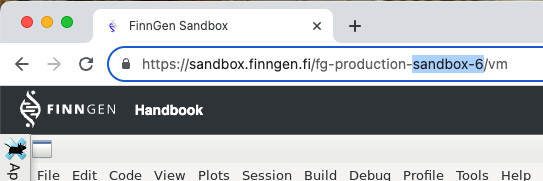

```{r, include = FALSE}
knitr::opts_chunk$set(
  collapse = TRUE,
  comment = "#>"
)
```

```{r setup}
library(FinnGenUtilsR)
```

# Configuration 

Similarly to `fg_get_cdm_config` (see vignette), we can use `fg_get_bq_config` to produce the connection configuration based on the sandbox number, and the dataFreeze you want to use.


- environment: You can find your sandbox number by looking at the url in your browser when connected to sandbox.



- dataFreezeNumber: At the time of writing dataFreeze can be 6, 7, 8, 9, 10, and 11, dataFreeze.


```{r}
 config <- fg_get_bq_config(
   environment = "sandbox-6",
   dataFreezeNumber = 11
   )
```


```{r, message=FALSE, echo=FALSE}
 config <- fg_get_bq_config(
   environment = "atlasDevelopment",
   dataFreezeNumber = 11
   )
```

# Create FGconnectionHandler object 

For convenience one can use function `create_fg_connection_handler_FromList` to generate a `FGconnectionHandler` object with the connection configuration from `fg_get_bq_config`. 

```{r}
FGconnectionHandler <- create_fg_connection_handler_FromList(config)
```

`FGconnectionHandler` is an object with that manage the connection to the FinnGen tables in BQ. 

First thing to do is to check the status of the connection. 
`FGdb$connectionStatusLog` not only shows if the connection is correct, but also if the `tempEmulationSchema` works, and all tables in the sandboxToolsSchema and   medicalCodesSchema schemas, 

```{r}
FGconnectionHandler$connectionStatusLog
```

It checks if the connection is established, if it is possible to create temporary tables, and gets a list of all the tables in the  sandboxToolsSchema and   medicalCodesSchema schemas. 


# Using FGconnectionHandler

`FGdb$connectionStatusLog` contains a list of the existing table in the sandboxToolsSchema and   medicalCodesSchema schemas. 
It is recomended to use the latests version of these tables. 

```{r}
FGconnectionHandler$getTblsandboxToolsSchema |> names()
```

Tables in the sandboxToolsSchema andmedicalCodesSchema can be used as if they were tibbles thanks to  [dbplyr](https://dbplyr.tidyverse.org/). 

```{r}
# get events with code "J45" in INPAT
FGconnectionHandler$getTblsandboxToolsSchema$finngen_r11_service_sector_detailed_longitudinal_v1() |> 
  dplyr::filter(code1 == "J45" & source == "INPAT")
```

(same table in html format for exporation)
```{r echo=FALSE}
FGconnectionHandler$getTblsandboxToolsSchema$finngen_r11_service_sector_detailed_longitudinal_v1() |> 
  dplyr::filter(code1 == "J45" & source == "INPAT") |> 
  as.data.frame()|> rmarkdown::paged_table()
```

At the moment of writing does not allow for the use of `str_detect`

```{r error=TRUE}
# get events with code "J45" and descendants
FGconnectionHandler$getTblsandboxToolsSchema$finngen_r11_service_sector_detailed_longitudinal_v1() |> 
  dplyr::filter(stringr::str_detect(code1, "^J45"))
```


A work around is to inject a sql statement instead (notice that this SQL is not based in BQ, but in [SqlRender](https://ohdsi.github.io/SqlRender/) dialect based mostly in MSsqlServer)

```{r}
# get events with code "J45" and descendants
FGconnectionHandler$getTblsandboxToolsSchema$finngen_r11_service_sector_detailed_longitudinal_v1() |> 
  dplyr::filter(dplyr::sql("code1 LIKE 'J45%'"))
```

(same table in html format for exporation)
```{r echo=FALSE}
FGconnectionHandler$getTblsandboxToolsSchema$finngen_r11_service_sector_detailed_longitudinal_v1() |> 
  dplyr::filter(dplyr::sql("code1 LIKE 'J45%'"))  |> 
  as.data.frame()|> rmarkdown::paged_table()
```

As an example we can plot the age of smoking status of all the subjects with an asthma diagnose: 

We get the asthma subjects by filtering the service sector data, and join the finngen_info data to get the smoke2, smoke3

```{r}
FGconnectionHandler$getTblsandboxToolsSchema$finngen_r11_service_sector_detailed_longitudinal_v1() |> 
  dplyr::filter(dplyr::sql("code1 LIKE 'J45%'"))|> 
  dplyr::distinct(finngenid) |> 
  dplyr::left_join(
    FGconnectionHandler$getTblsandboxToolsSchema$finngenid_info_r11_v1(), 
    by = "finngenid"
  ) |> 
  dplyr::count(smoke2, smoke3, sort = T)
  
```

(same table in html format for exporation)
```{r echo=FALSE}
FGconnectionHandler$getTblsandboxToolsSchema$finngen_r11_service_sector_detailed_longitudinal_v1() |> 
  dplyr::filter(dplyr::sql("code1 LIKE 'J45%'"))|> 
  dplyr::distinct(finngenid) |> 
  dplyr::left_join(
    FGconnectionHandler$getTblsandboxToolsSchema$finngenid_info_r11_v1(), 
    by = "finngenid"
  ) |> 
  dplyr::count(smoke2, smoke3, sort = T) |> 
  as.data.frame()|> rmarkdown::paged_table()
```


