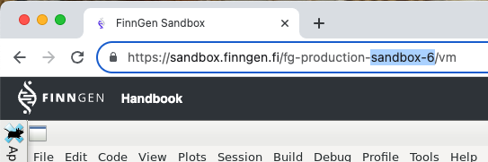

```{r, include = FALSE}
knitr::opts_chunk$set(
  collapse = TRUE,
  comment = "#>"
)
```

```{r setup}
library(FinnGenUtilsR)
```

# Getting configuration to connect to OMOP-CDM

Function `get_cdm_config` provides all the information needed to use one of the OMOP-CDM in FinnGen. 
You only need to specify the sandbox number, and the dataFreeze you want to use. 
You can find your sandbox number by looking at the url in your browser when connected to sandbox. 



At the time of writing dataFreeze can be 6, 7, 8, 9, 10, and 11, dataFreeze.

```{r, eval=FALSE}
 config <- FinnGenUtilsR::get_cdm_config(
   environment = "sandbox-6", 
   dataFreezeNumber = 11
   )
```

```{r, message=FALSE, echo=FALSE}
 config <- FinnGenUtilsR::get_cdm_config(
   environment = "atlasDevelopment", 
   dataFreezeNumber = 11
   )
```

By default `get_cdm_config` provides a list, but we can also plot this in yalm format to evaluate it better 
```{r}
 FinnGenUtilsR::get_cdm_config(
   environment = "sandbox-6", 
   dataFreezeNumber = 11, 
   asYalm = TRUE
 ) |> cat()
```

# Example using config to execute a Cohort Diagnostics analysis

Using this settings we can run an analysis similar to the [example in Cohort Diagnostics package](https://ohdsi.github.io/CohortDiagnostics/articles/RunningCohortDiagnostics.html)

## Configuring the connection to the server

```{r}
connectionDetails <- DatabaseConnector::createConnectionDetails( 
  dbms = config$connection$connectionDetailsSettings$dbms,
  connectionString = config$connection$connectionDetailsSettings$connectionString,
  user = config$connection$connectionDetailsSettings$user,
  password = config$connection$connectionDetailsSettings$password,
  pathToDriver = config$connection$connectionDetailsSettings$pathToDriver
)

options(sqlRenderTempEmulationSchema = config$connection$tempEmulationSchema)
```

## Loading cohort references from webapi

```{r, eval=FALSE}
# Set up url
baseUrl <- config$webAPIurl
# list of cohort ids
cohortIds <- c(2241, 2240, 2239)

cohortDefinitionSet <- ROhdsiWebApi::exportCohortDefinitionSet(
  baseUrl = baseUrl,
  cohortIds = cohortIds,
  generateStats = TRUE
)
```


```{r results = FALSE,message = FALSE,warning=FALSE,eval=FALSE}
library(CohortDiagnostics)
cohortDefinitionSet <- CohortGenerator::getCohortDefinitionSet(
  settingsFileName = "Cohorts.csv",
  jsonFolder = "cohorts",
  sqlFolder = "sql/sql_server",
  packageName = "CohortDiagnostics"
)|>  
  dplyr::filter(cohortId!=14909) 

cohortDefinitionSet$cohortId <- c(2241, 2240, 2239)
cohortDefinitionSet$name <- c(
  "[Test Hades Tools] Gastrointestinal hemorrhage 1",
  "[Test Hades Tools] Gastrointestinal hemorrhage 2",
  "[Test Hades Tools] Type 2 diabetes mellitus"
)

```

## Generate cohorts

```{r}
cohortTableNames <- CohortGenerator::getCohortTableNames(cohortTable = config$cohortTable$cohortTableName)

# Next create the tables on the database
CohortGenerator::createCohortTables(
  connectionDetails = connectionDetails,
  cohortTableNames = cohortTableNames,
  cohortDatabaseSchema = config$cohortTable$cohortDatabaseSchema,
  incremental = FALSE
)

# Generate the cohort set
CohortGenerator::generateCohortSet(
  connectionDetails = connectionDetails,
  cdmDatabaseSchema = config$cdm$cdmDatabaseSchema,
  cohortDatabaseSchema = config$cohortTable$cohortDatabaseSchema,
  cohortTableNames = cohortTableNames,
  cohortDefinitionSet = cohortDefinitionSet,
  incremental = FALSE
)

# cohort couts 
CohortGenerator::getCohortCounts(
  connectionDetails = connectionDetails,
  cohortDatabaseSchema = config$cohortTable$cohortDatabaseSchema,
  cohortTable = config$cohortTable$cohortTableName
)


# execute cohort diagnostics ---------------------------
exportFolder <- "export"

CohortDiagnostics::executeDiagnostics(cohortDefinitionSet,
                   connectionDetails = connectionDetails,
                   cohortTable = config$cohortTable$cohortTableName,
                   cohortDatabaseSchema = config$cohortTable$cohortDatabaseSchema,
                   cdmDatabaseSchema = config$cdm$cdmDatabaseSchema,
                   exportFolder = exportFolder,
                   databaseId = "MyCdm",
                   minCellCount = 5
)


# visualise cohort diagnostics 

CohortDiagnostics::createMergedResultsFile(exportFolder, sqliteDbPath = "MyCohortDiagnosticsResulst.sqlite", overwrite = TRUE)
CohortDiagnostics::launchDiagnosticsExplorer(sqliteDbPath = "MyCohortDiagnosticsResulst.sqlite")


```
